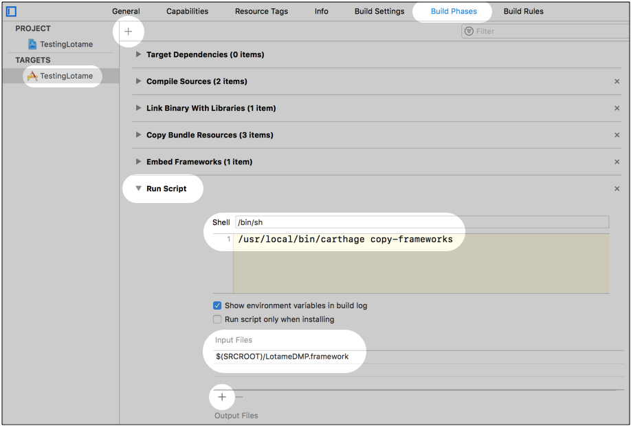

# LotameDMP-IOS
This open source library can be leveraged by Lotame clients to collect data from within their iOS applications.

[](http://cocoapods.org/pods/LotameDMP)
[](http://cocoapods.org/pods/LotameDMP)
[](http://cocoapods.org/pods/LotameDMP)

## Requirements

LotameDMP requires Xcode 12 and at least iOS 11.0.  It will work with Swift or Objective-C.

## Example

To run the example project:

1. Clone the repo
1. Go to the Example directory `cd Example/`
1. Run `pod install`
1. Open `LotameDMP.xcworkspace`. Do not open the `.xcodeproj`.
1. Within Xcode, change the scheme from **LotameDMP** (with the toolbox icon) to **LotameDMP-Example**.
1. Build and Run

## Installation

> **Embedded frameworks require a minimum deployment target of iOS 10 or OS X Sierra (10.12).**

### CocoaPods

[CocoaPods](http://cocoapods.org) is a dependency manager for Cocoa projects.

CocoaPods 1.2.1 is required to build LotameDMP. You can install it with the following command:

```bash
$ gem install cocoapods
```

To integrate LotameDMP into your Xcode project using CocoaPods, specify it in your `Podfile`:

```ruby
source 'https://github.com/CocoaPods/Specs.git'
use_frameworks!

target "YourTargetName" do
  pod 'LotameDMP', '~> 5.3'
end
```

**Note**: Make sure to update the name of your target

Then, run the following command:

```bash
$ pod repo update
$ pod install
```

**Note**: Make sure to update your local CocoaPod repo if you haven't done so recently.

Close your `.xcodeproj` file, and open the generated `.xcworkspace`.

Add the following elements to your project's `Info.plist` file to configure ATS:

```xml
    <key>NSAppTransportSecurity</key>
    <dict>
        <key>NSExceptionDomains</key>
        <dict>
            <key>crwdcntrl.net</key>
            <dict>
                <key>NSIncludesSubdomains</key>
                <true/>
                <key>NSExceptionRequiresForwardSecrecy</key>
                <false/>
            </dict>
        </dict>
    </dict>
```

### Carthage

[Carthage](https://github.com/Carthage/Carthage) is a dependency manager alternative to CocoaPods.

You can install Carthage using Homebrew:

```
$ brew update
$ brew install carthage
```

Create a file named `Cartfile`, and add the following text:

```
github "Lotame/LotameDMP-IOS" ~> 5.3
```

Run `carthage update`. 

This generates the following file:

```
./Carthage/Build/iOS/LotameDMP.framework
```

To install:

1. Open Xcode and go to **Target** > **General** > **Embedded Binaries**
1. Drag the `LotameDMP.framework` into the **Embedded Binaries** section. 
1. When prompted, check the box for **Copy items if needed**. 

Finally, scroll further down in the README to the **Adding a Run Script phase** section for one final configuration step.

### Drag-and-drop installation

Download the following file:

[tag-5.3.0-swift-5.3.2-framework.zip](dist/tag-5.3.0-swift-5.3.2-framework.zip?raw=true)

Unzip it, and you should see the `LotameDMP.framework` inside. 

To install:

1. Open Xcode and go to **Target** > **General** > **Embedded Binaries**
1. Drag the `LotameDMP.framework` into the **Embedded Binaries** section. 
1. When prompted, check the box for **Copy items if needed**. 

**Note about Swift versions**: In order for drag-and-drop to work, you must be using the same version of Swift as the pre-compiled framework. The distribution folder contents are labeled with the tag and Swift version, so you know the code state and Swift compatability, respectively. If you're using a different version of Swift, you have a few options:

1. Use CocoaPods
1. Use Carthage
1. Download the repo, and run the `./build_framework.sh` script. This generates a framework zip file in the `dist` folder.

Finally, scroll further down in the README to the **Adding a Run Script phase** section for one final configuration step.

### Adding a Run Script phase

This section only applies to the **Carthage** and **Drag-and-Drop** installation methods. The `.framework` file generated by these two methods contains binaries for both Simulator and device -- both of which you'll need for app development. 

The problem is that App Store submission has a validation process that will automatically reject your build, because it contains binary slices for the Simulator. 

In order to submit your app to the App Store, you need to add a **Run Script** that removes these unwanted slices.

1. Select your App Target and go to **Build Phases**
1. Click the **+** button, and add a **New Run Script Phase**
1. Leave the **Shell** as `/bin/sh`
1. In the body of the shell script, paste the following: 
```/usr/local/bin/carthage copy-frameworks```
1. Under **Input Files**, add a path to the `LotameDMP.framework`. This varies based on your installation method:

* **Carthage**: `$(SRCROOT)/Carthage/Build/iOS/LotameDMP.framework`
* **Drag-and-Drop**: `$(SRCROOT)/LotameDMP.framework`

Your screen should look something like this:



If you skip this step, you'll still be able to build, run, and develop. But you'll see the errors when validating your binary during app store submission.

## Usage

LotameDMP must be imported by any file using the library.

```swift
import LotameDMP
```

or for Objective-C

```objective-c
#import "LotameDMP-Swift.h"
```

### Initialization

LotameDMP is a singleton that must be initialized with either a single client id or optionally two client ids (one for data collection and a separate one for audience membership) once before using it.  Run one of the following commands, depending on your implementation, before executing any other calls:

```swift
DMP.initialize("YOUR_CLIENT_ID_NUMBER")
```

or if you would like to use a different client id for audience memberships

```
DMP.initialize("YOUR_CLIENT_ID_NUMBER", "YOUR_CLIENT_ID_FOR_AUDIENCES")
```

or for Objective-C...

```objective-c
[DMP initialize:@"YOUR_CLIENT_ID_NUMBER_"];
```

or if you would like to use a different client id for audience memberships...

```
[DMP initialize:@"YOUR_CLIENT_ID_NUMBER_", @"YOUR_CLIENT_ID_FOR_AUDIENCES"];
```

or if you would like to enable panorama id...

```
[DMP initialize:@"YOUR_CLIENT_ID_NUMBER_", @"YOUR_CLIENT_ID_FOR_AUDIENCES", true];
```

The initialize call starts a new session and sets the domain and protocols to their default values (https://*.crwdcntrl.net)

### Send Behaviors

Behavior Data is collected through one of the add commands:

```swift
DMP.addBehaviorData("value", forType: "type")
DMP.addBehaviorData(behaviorId: 1)
```

or for Objective-C

```objective-c
[DMP addBehaviorData:@"value" forType: @"type"];
[DMP addBehaviorDataWithBehaviorId: 1];
```

Multiple behaviors can be appended as detailed above. Once all of the relevant behavior data for the screen or action has been appended, it must be sent to the server to record the behaviors:

```swift
DMP.sendBehaviorData()
```

or for Objective-C

```objective-c
[DMP sendBehaviorData];
```

If you're interested in the success or failure of sending the data, use a completion handler:

```swift
DMP.sendBehaviorData(){
	result in
	if result.isSuccess{
		//Success
	} else{
		//Failure
	}
}
```

or for Objective-C

```objective-c
[DMP sendBehaviorDataWithHandler: ^(NSError * _Nullable error){
    if (error != nil){
        //Failure
    } else {
        //Success
    }
}];
```

### Get Audience Data

Get the audience data or panorama id with the following command:

```swift
DMP.getAudienceData{
	result in
	if let profile = result.value{
		//Successful request, use LotameProfile object (ie. profile.panoramaId or profile.audiences)
	} else {
		//result.error will contain an error object
	}
}
```

or for Objective-C

```objective-c
[DMP getAudienceDataWithHandler:^(LotameProfile * _Nullable profile, BOOL success) {
        if (success) { //Check for success
            //Successful request, use LotameProfile object
        }
}];
```

The completion handler uses a Result enum to indicate success or failure.

### Start a New Session

To indicate that a new session has started, use the following command:

```swift
DMP.startNewSession()
```

or for Objective-C

```objective-c
[DMP startNewSession];
```

### Send an HTTP or HTTPs request using the supplied URL pattern

This pattern can contain two replacement macros, {deviceid} and {deviceidtype}, which will be replaced before performing the HTTP(s) call.

```swift
DMP.sendRequest(urlPattern: "http://xyz.com/getData?mid={deviceid}&dt={deviceidtype}")
```

or for Objective-C

```objective-c
[DMP sendRequest urlPattern:@"http://xyz.com/getData?mid={deviceid}&dt={deviceidtype}"];
```

## About this version

Version 5.3.0 Provides an initialize method to enable panorama id and a path to retrieve it via an audience extraction.

Version 5.2.0 Provides the ability to use a different client id for audience extractions. It also bumps the minimum iOS version up to 14.5 for the new tracking API.

Version 5.1.0 Handles iOS 14 changes for tracking authorization and provides the ability to use a separate client id for audience membership requests.

Version 5.0.0 upgrades to swift 5.

Version 4.1.0 removes dependencies on AlamoFire and SwiftyJSON. It also generates a `.framework` file for drag-and-drop installation.

Version 4.0.0 updates the code to Swift 3, since Xcode 8.3.2 dropped support for Swift 2.3.

The previous version of Lotame `3.0.1` had a dependency on Alamofire `2.0`. This dependency has been updated to Alamofire `4.4`. If your project leveraged Alamofire, please see their migration guide for updating your network calls.

## Note to maintainers

When changing the version, make sure to update these 3 locations:

1. `LotameDMP.podspec`
1. Git tag
1. `sdkVersion` in `DMP.swift`

When a new version of Swift is released, run the `./build_framework.sh` script. This will generate a new zip file in the `dist` folder, labeled with the current git tag and Swift version of your local Mac. Push the generated zip file to the repo, and update its link in the **Drag-and-drop installation** section of this file.

## License

LotameDMP is available under the MIT license. See the LICENSE file for more info.

